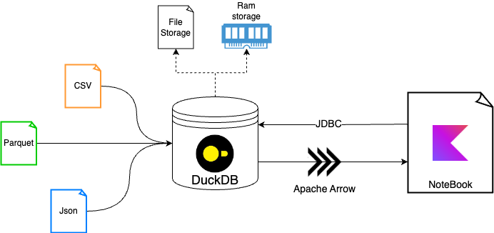

# sKience
sKience is a demonstration project illustrating the utilization of a modern technology stack to facilitate the practice of data science with Kotlin effortlessly.

This repository contains the notebooks I used for my talk (in 🇫🇷) about [Data science in Kotlin at Devoxx France 2024](https://www.youtube.com/watch?v=VJRPiJqng2U)

## Introduction

[introduction notebook](./src/notebook/introduction.ipynb) contains basic kotlin notebook features such as input/output and dependencies management.

## Dataframe

[Dataframe notebook](./src/notebook/dataframe.ipynb) show some features of both Dataframe and Kandy library to manipulate data

## DuckDB

[DuckDB](https://duckdb.org/) is an analytic database that can be easily use with kotlin Dataframe in a kotlin notebook to act as interface of many data.

 

[Duckdb Dataftame notebook](./src/notebook/duckdb_dataframe.ipynb) show advanced usages of kotlin dataframe with duckDB.

To run this notebook you must run [import data notebook](./src/notebook/import_data.ipynb). It will create a duckDB database file that contains New York yellow taxi trip for 5 years which represents about 10GB and 400 millions database rows  

## Docker
To run notebooks with [jupyter](https://jupyter.org/) in docker use `docker compose up` command from the base directory. 
